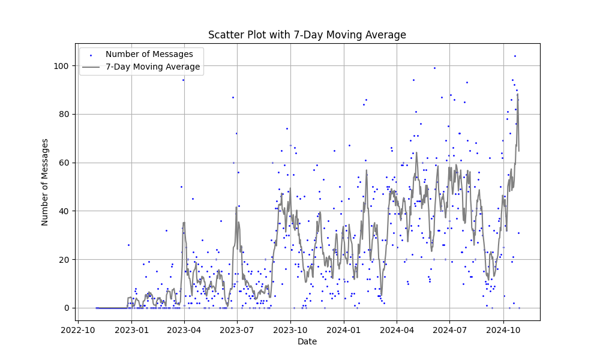

# ChatGPT Usage Analysis

This project processes ChatGPT usage data exported by the user and generates analytical visualizations, including message counts, moving averages, and box plots. The output includes CSV, PNG, and interactive HTML files.

## Example Output



## Project Structure

```
├── .gitignore
├── data/
├── output/
│   ├── box_plot.html
│   ├── box_plot.png
│   ├── message_counts.csv
│   ├── message_counts.html
│   ├── message_counts.png
│   ├── scatter_moving_avg.html
│   ├── scatter_moving_avg.png
├── src/
│   ├── change_json_structure.py
│   ├── create_time_data.py
│   ├── generate_diagrams.py
│   ├── main.py
├── requirements.txt
└── README.md
```

## Prerequisites

- **Python 3.10+**
- **Packages**: Install the required packages with `pip install -r requirements.txt`.

## Setup

1. **Export and Prepare Data**: 
   - Export ChatGPT usage data and unzip it into the `./data` folder.
   
2. **Install Requirements**:
   ```bash
   pip install -r requirements.txt
   ```

## Usage

Run the project with:
```bash
python src/main.py
```

This will process the usage data, generate message count statistics, and produce visualizations in the `output/` folder.

## Output

The output files include:

- **Message Counts**:
    - `message_counts.csv`: CSV file of daily message counts.
    - `message_counts.png`: Static line plot of daily message counts.
    - `message_counts.html`: Interactive HTML line plot.

- **Scatter Plot with Moving Average**:
    - `scatter_moving_avg.png`: Scatter plot with 7-day moving average.
    - `scatter_moving_avg.html`: Interactive HTML version.

- **Box Plot**:
    - `box_plot.png`: Static box plot of daily message counts.
    - `box_plot.html`: Interactive HTML version.

## File Descriptions

- `.gitignore`: Specifies files and folders to ignore in Git.
- `.idea/`: Directory containing IDE configuration files.
- `data/README.md`: Placeholder file for usage data documentation.
- `output/`: Directory for generated outputs (CSV, PNG, HTML).
- `src/change_json_structure.py`: Script to reformat the JSON structure.
- `src/create_time_data.py`: Script to create time-based data from usage data.
- `src/generate_diagrams.py`: Script to generate diagrams from the CSV data.
- `src/main.py`: Main script to execute all steps.
